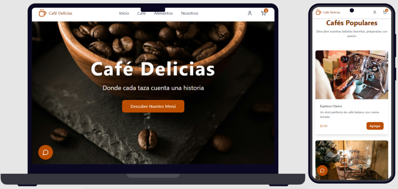

# Cafetería Website

Landing page moderna y elegante para cafetería, desarrollada con React y Vite. Presenta un diseño limpio y profesional que destaca bebidas, alimentos y servicios de manera atractiva e interactiva.

## Tabla de Contenidos

- [Características](#características)
- [Capturas de Pantalla](#capturas-de-pantalla)
- [Tecnologías](#tecnologías)
- [Requisitos Previos](#requisitos-previos)
- [Instalación](#instalación)
- [Demo](#demo)
- [Estructura del Proyecto](#estructura-del-proyecto)
- [Funcionalidades](#funcionalidades)
- [Agradecimientos](#agradecimientos)

## Características

- Diseño completamente responsive adaptable a todos los dispositivos
- Interfaz moderna y elegante siguiendo las mejores prácticas de UI/UX
- Catálogo interactivo de bebidas y alimentos
- Chatbot integrado para atención al cliente
- Sección "Sobre Nosotros" con historia de la cafetería
- Componentes React reutilizables y modulares
- Optimizada para SEO con estructura semántica
- Build optimizado con Vite para carga ultra rápida
- Hot Module Replacement (HMR) para desarrollo ágil

## Capturas de Pantalla



## Tecnologías

- **React 18**: Biblioteca JavaScript para interfaces de usuario
- **TypeScript**: Superset de JavaScript con tipado estático
- **Vite 6**: Build tool ultrarrápido y servidor de desarrollo
- **CSS3**: Estilos modernos con Flexbox y Grid Layout
- **React Hooks**: useState, useEffect para gestión de estado
- **Font Awesome**: Iconos vectoriales
- **Google Fonts**: Tipografías personalizadas

## Requisitos Previos

Antes de comenzar, asegúrate de tener instalado:

- [Node.js](https://nodejs.org/) (versión 16 o superior)
- [npm](https://www.npmjs.com/)
- [Git](https://git-scm.com/)
- Editor de código (recomendado: VS Code)

Verifica las versiones instaladas:
```bash
node --version  # Debería ser v16+
npm --version   # Debería ser v8+
```

## Instalación

Sigue estos pasos para instalar y ejecutar el proyecto localmente:

1. **Clona el repositorio**
```bash
git clone https://github.com/brayanhl17/cafeteria-website.git
```

2. **Navega al directorio del proyecto**
```bash
cd cafeteria-website
```

3. **Instala las dependencias**
```bash
npm install
```

4. **Inicia el servidor de desarrollo**
```bash
npm run dev
```

5. **Accede a la aplicación**
```
http://localhost:3000
```

El servidor se recargará automáticamente cuando hagas cambios en el código.

## Demo

Prueba la aplicación en vivo sin necesidad de instalar nada:

**[Ver Demo en Vivo](https://cafe-delicias.netlify.app)**

### Configurar Netlify

Para publicar tu propia versión:

**Netlify:**
1. Conecta tu repositorio de GitHub
2. Configura Build settings:
   - Build command: `npm run build`
   - Publish directory: `build`
3. Deploy automático en cada push


## Estructura del Proyecto

```
cafeteria-website/
│
├── src/
│   ├── components/           # Componentes React
│   │   ├── figma/           # Componentes de diseño
│   │   │   └── ...
│   │   └── ui/              # Componentes de interfaz
│   │       ├── Chatbot.tsx
│   │       ├── Footer.tsx
│   │       ├── Hero.tsx
│   │       ├── Navbar.tsx
│   │       ├── ProductCard.tsx
│   │       └── ServicesSection.tsx
│   │
│   ├── styles/              # Estilos globales
│   │   └── ...
│   │
│   ├── App.tsx              # Componente principal
│   ├── index.css            # Estilos base
│   └── main.tsx             # Punto de entrada
│
├── .gitignore               # Archivos ignorados por Git
├── index.html               # HTML base
├── package.json             # Dependencias y scripts
├── README.md                # Este archivo
└── vite.config.ts           # Configuración de Vite
```

## Funcionalidades

### Sección Hero
- Banner principal con imagen de fondo impactante
- Llamados a la acción (CTA) destacados
- Diseño optimizado para conversión
- Mensaje de bienvenida

### Catálogo de Cafés
- Grid responsivo de tarjetas de productos
- Imágenes de alta calidad de bebidas
- Descripciones y precios
- Efectos hover interactivos

### Menú de Alimentos
- Presentación visual de platillos
- Información nutricional
- Sistema de categorización
- Diseño apetitoso y profesional
- Precios actualizados

### Sobre Nosotros
- Historia de la cafetería
- Valores y misión

### Servicios
- Lista de servicios ofrecidos
- Horarios de atención

### Chatbot Interactivo
- Asistente virtual para consultas
- Respuestas automáticas
- Interfaz amigable
- Integración fluida con el diseño
- Disponible 24/7

### Footer
- Enlaces a redes sociales
- Información de contacto
- Mapa de ubicación
- Horarios de servicio
- Navegación rápida por secciones

### Características Técnicas
- Componentes React modulares y reutilizables
- Gestión de estado con React Hooks
- Lazy loading de imágenes
- Code splitting automático con Vite
- Hot Module Replacement (HMR)
- Build optimizado para producción
- CSS Modules para estilos encapsulados
- Compatibilidad cross-browser
- Optimización SEO


## Agradecimientos

- A Figma AI por el diseño 
- A Unsplash por las imágenes

---

⭐ Si este proyecto te fue útil, considera darle una estrella en GitHub

💬 ¿Tienes preguntas o sugerencias? Abre un [issue](https://github.com/brayanhl17/cafeteria-website/issues)

☕ Desarrollado con 💙 por [Brayan HL](https://github.com/brayanhl17)